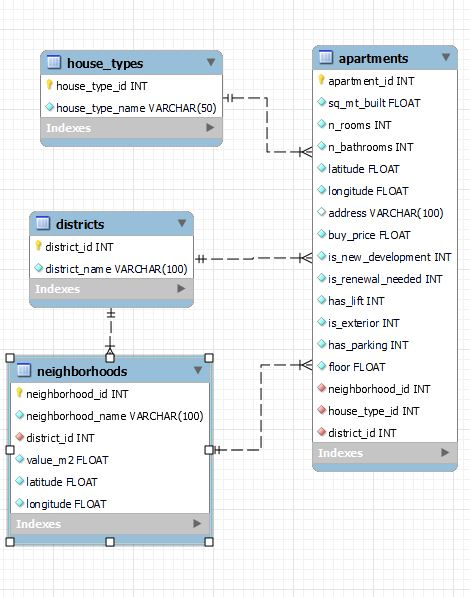

# "Tu pisito" project:

The goal of this project is to create a web page that helps you to find the best home for you. It connects with Idealista and Google Maps API to get information and a MySQL database in the backend. Also uses streamlit to provide a simple buy useful web page for users.

This project has several stages defined:
1. Dataframe selection, cleaning and manipulation.
2. MySQL database structure and tables creation.
3. Create a prediction model for houses. 
4. Connecting Idealista API.
5. Connecting Google Maps API.
6. Creating a web page with streamlit. 

## Files structure:

- Python file (main.py): File that initialize the streamlit page.
- "config" folder with:
    - Python file (configuration.py) with all the basic configurations to connect to MySQL.
- "mysql" folder:
    - SQL file (create-db.sql): MySQL file to create from zero the database necesary for this project.
    - SQL file (basic-data.sql): MySQL file to import static data to districts and house_types of the tables.
    - SQL file (test-queries.sql): MySQL file used to test some query and how the db and the tables were working.
- "tools" folder with:
    - Python file (functions.py): File with all general functions.
    - Python file (google_functions.py): File with all API Google Maps functions.
    - Python file (idealista_functions.py): File with all Idealista API functions.
- "notebooks" folder with several Jupyter Notebooks, most important are:
    - Jupyter notebook file (api_idealista.py): File with different response tests from Idealista API.
- "image" folder with:
    - Coverpage image (madrid.jpg)
    - Schema of MySQL database structure (mysql-db-structure.jpg)
- "model" folder the last machine learning model:
    - "GBM_grid__1_AutoML_20210728_185537_model_16" file
- "data" folder with several CSV files

## Libraries used:

- [Pandas](https://pandas.pydata.org/)
- [Sqlalchemy](https://www.sqlalchemy.org/)
- [Streamlit](https://docs.streamlit.io/en/stable/api.html)
- [JSON](https://docs.python.org/3/library/json.html)
- [Requests](https://docs.python-requests.org/en/master/)
- [Dotenv](https://pypi.org/project/python-dotenv/)
- [Pillow - PIL](https://pillow.readthedocs.io/en/stable/reference/Image.html)
- [Seaborn](https://seaborn.pydata.org/introduction.html)
- [H2O](https://docs.h2o.ai/h2o/latest-stable/h2o-py/docs/intro.html)
- [Numpy](https://numpy.org/)
- [Geopy](https://geopy.readthedocs.io/en/stable/)

## DB used:

- [MySQL](https://www.mysql.com/)

### MySQL Structure:

